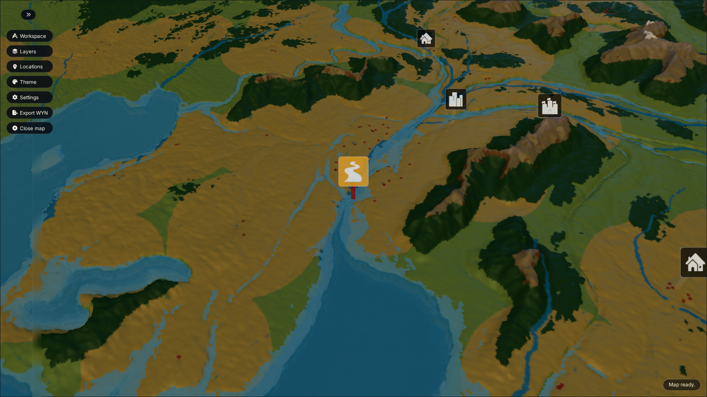
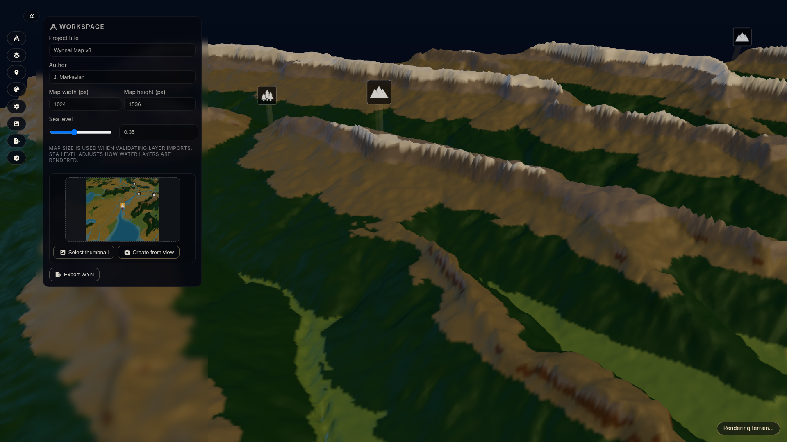
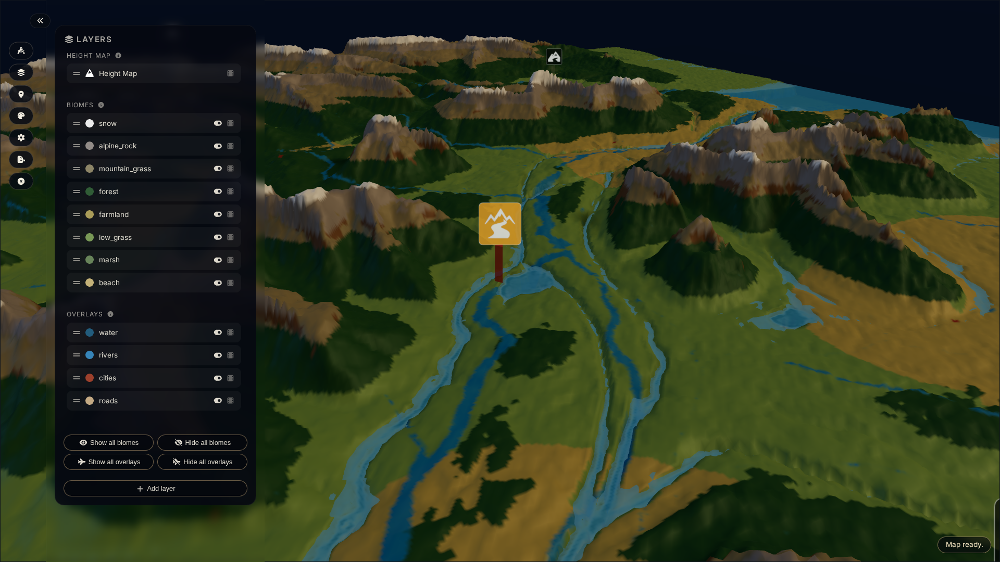
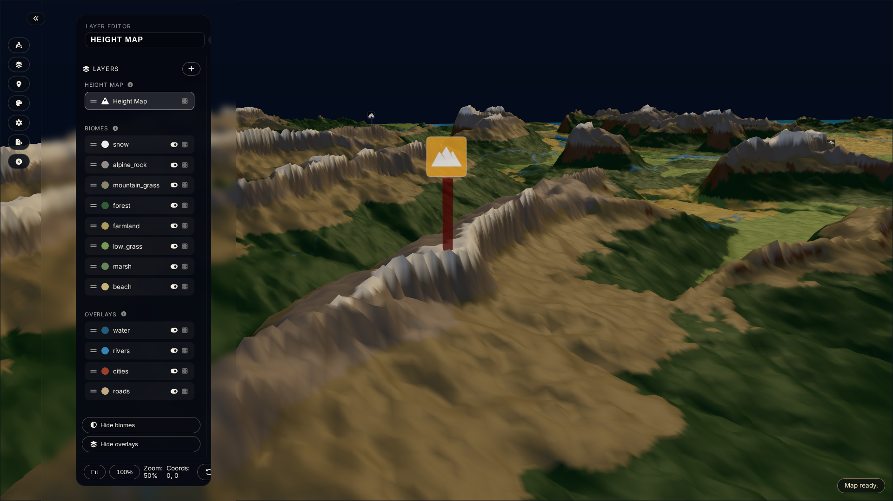
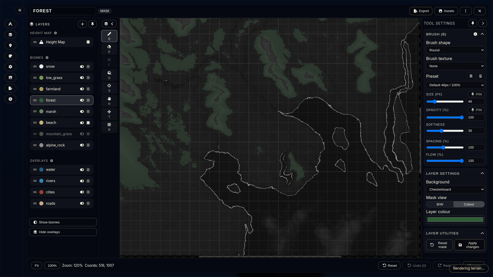
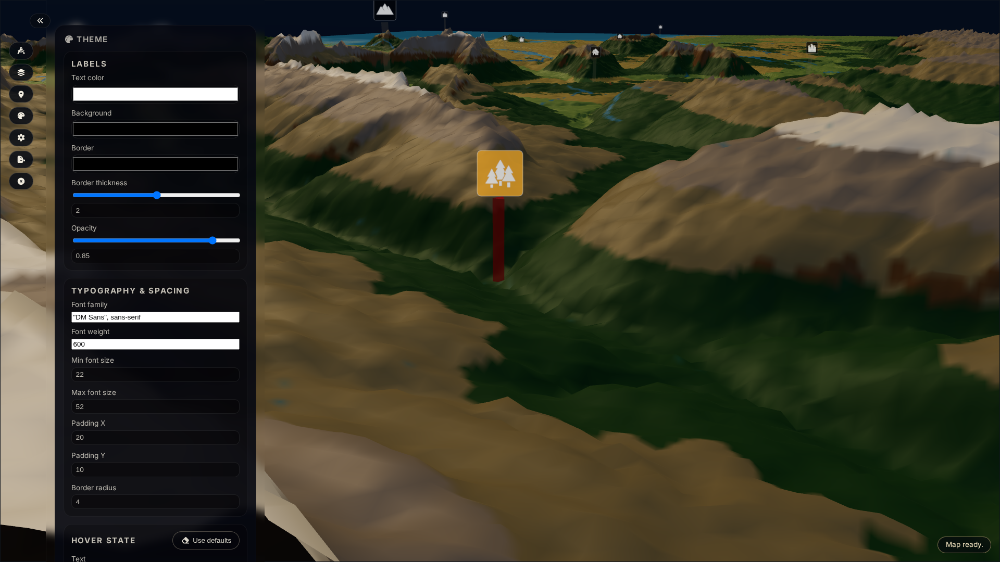
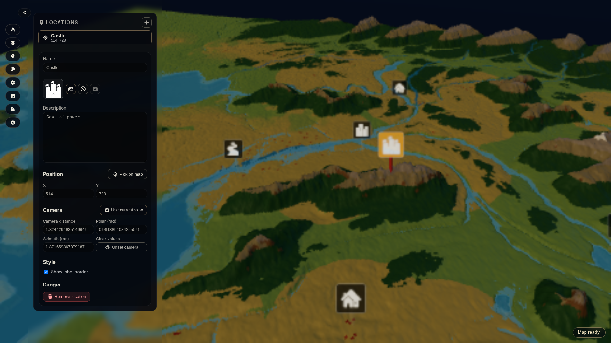
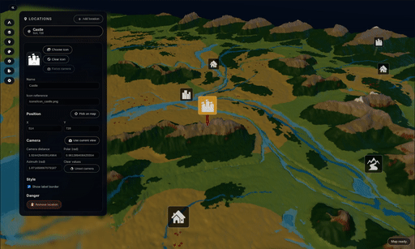
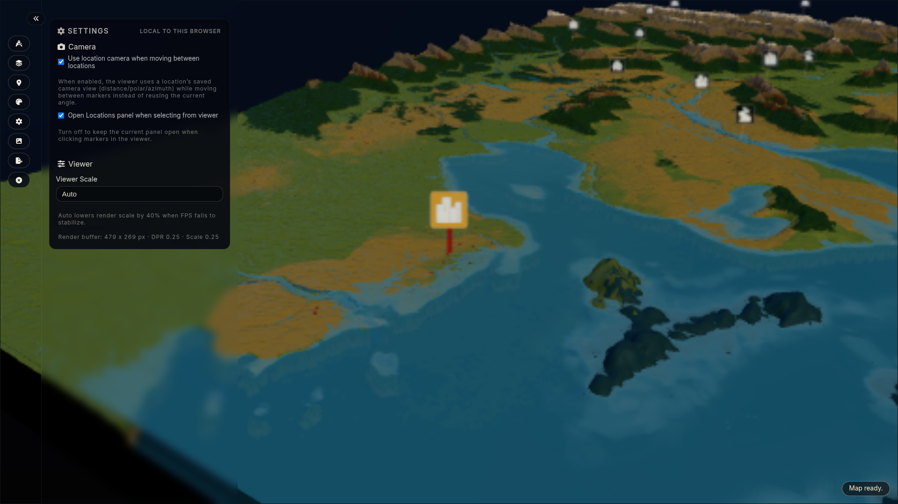

# Terrain Editor User Guide

This guide summarizes the current capabilities of the terrain editor so new contributors can quickly understand what works today.

**At a glance you can:**
- Sculpt heightmaps and paint biome/overlay masks with brush + onion-skin tooling.
- Theme, label, and save camera fly-tos for every location.
- Export deterministic `.wyn` archives for reuse, testing, and documentation captures.

## Panels & Workspace

### Panel Dock + Toolbar
Single-column dock hosts Workspace, Layers, Theme, Locations, and Settings panels. The toolbar keeps context-aware actions (Load sample, Export WYN, Close map) close to hand, collapses gracefully when the dock hides, and remembers the last active panel for quick context switching.



### Workspace Panel
Launch a new project, reopen an existing `.wyn`, or load the bundled Wynnal sample without leaving the dock. Once a map is active the form exposes project title, author, pixel dimensions, and sea level sliders. Changing the size remounts the viewer instantly so the canvas always matches the declared resolution. The Export button keeps a deterministic `.wyn` snapshot a click away.



### Layers Panel
- Layer list groups heightmap, biome, and overlay entries with drag handles, pill drop zones, and inline visibility/onion-skin toggles.
- Hovering a pill reveals quick actions plus section hints, so you always know how biomes stack and where overlays render.
- Click any layer to open it in the editor, or drag between compatible sections to reorganize the legend.



Each editable layer is backed by a grayscale mask (heightmap or biome) that the tools modify directly, so visibility and onion-skin toggles reflect the live data.

### Layer Editor
- Inline editor brings a full mask canvas, tool palette, brush controls, layer list, and utilities (export, reset, onion-skin pickers) into a single view.
- Brush/erase/flatten/hand tools expose size, opacity, softness, spacing, and flow sliders—heightmap layers unlock flatten tooling while biomes respect tint colours. Each button surfaces its keyboard shortcut for quick swapping (details below).
- Canvas utilities: checkerboard or solid background, **Mask view toggle (B/W or Colour)** that syncs to the URL, undo/redo history, onion-skin overlays, export with optional alpha, fit/zoom shortcuts, and persistent view state (`leo`) so deep links reopen exactly where you left off.

**Height Map tooling example**



**Forest biome editing example**



### Theme Panel
Fine-tune location labels: text/background/border colours, opacity, padding, border radius, font stack, weight, and size limits. Hover/focus states get their own palettes with “Use defaults” buttons, while the stem editor swaps icon shapes without touching the legend.



### Locations Panel
Manage every marker and its camera framing from one place. Pick on map, drag-and-drop icons, name or reorder, capture the current camera for quick fly-to animations, edit saved distance/polar/azimuth values, toggle label borders, or remove a location entirely. The selector button and dialog make it easy to jump between markers, while the preview area keeps icon uploads and replacements frictionless.



<a href="documentation/animations/looping-location-demo-capture.mp4">
  <kbd>
    
  </kbd>
</a>

### Settings Panel

Quality-of-life toggles for the local machine. Settings are stored in browser storage only—they do not sync across devices or `.wyn` exports.

- “Use location camera when moving between locations” replays each marker’s saved distance/polar/azimuth so tours feel cinematic.
- “Open Locations panel when selecting from viewer” keeps the dock in sync with map clicks (or stays put if you prefer editing elsewhere).



## Project & Assets

- Load `.wyn` archives from disk (drag/drop or file picker). Assets and metadata hydrate workspace state via `createProjectStore`.
- Save/export: rebuild `.wyn` with deterministic file tables and updated legend/theme/locations via `buildWynArchive`.
- Asset library dialog manages shared icons, previews, replacements, and deletions with URL cache cleanup.

## Viewer Integration

- Embedded three.js viewer shares state with the editor. Camera URL params (`camera`) and layer visibility (`layers`) stay in sync through `useUrlState`.
- Onion-skin overlays fade neighbouring masks for context without blocking input.

## Keyboard & Interaction

- Tool palette includes shortcut hints (B/E/F/G/S/H/T). Mask editor supports pointer pan (hand tool or hold space in future) and holds view state until user interacts.
- Confirm dialogs protect destructive operations (e.g., delete layer, close map).
- Quick reference: `B` brush, `E` erase, `F` flatten (heightmap), `G` fill (reserved), `S` select (reserved), `H` hand, `T` transform (reserved). Escape closes dialogs, Enter confirms common prompts.

## Mask View Toggle (New)

- Layer settings now include a “Mask view” segmented control (B/W vs Colour). Colour mode overlays the mask using the layer’s tint to help inspect overlapping biomes. Heightmaps automatically fall back to B/W since colour tint doesn’t apply.

## URL Parameters for Deep Linking

The editor supports several URL parameters to allow direct navigation to specific states for testing, documentation, or sharing:

- `panel`: Open a specific panel (e.g., `?panel=layers`)
- `layer`: Select a specific layer by ID (e.g., `?layer=biome:forest`)
- `camera`: Set the viewer camera (e.g., `?camera=1.8,0.9,1.8,530,746`)
- `leo`: Set the layer editor view state (zoom/center)
- `location`: Select a specific location by ID (e.g., `?location=capital`)

**Example:**

```
/editor/?panel=locations&location=capital&camera=1.8,0.9,1.8,530,746
```

This will open the editor with the Locations panel active, select the location with ID `capital`, and set the camera to the specified state.

These parameters are useful for Playwright tests, documentation screenshots, and sharing reproducible scenes.

---

**Future updates**
- **Editing**: layer asset uploads, more brush types/noise, custom brush presets.
- **Documentation & playback**: GIF/Video captures via Playwright traces + ffmpeg.
